# Document Extraction & Optimization Demo

AI-powered Streamlit application that extracts structured information from technical documents and 3D CAD files using Google Vertex AI Gemini models.

## Features

### 📋 Work Package Extraction
- Multiple predefined schemas (Basic, Advanced, Task-Based, Construction Work Package)
- Document input from Google Cloud Storage or local upload
- Interactive JSON editing with validation and analytics
- Critical path analysis and resource planning for task-based extractions

### 🎨 IFC Drawing Analysis
- Comprehensive 3D CAD processing (up to 1.2M characters)
- Real-time component extraction validation
- Spatial analysis with coordinates, materials, and dimensions
- Multiple visualization modes

### 🔧 Technical Capabilities
- Gemini 2.5 Pro/Flash model selection with Provisioned Throughput
- Google Authentication integration
- Export options (JSON download/clipboard) with BigQuery integration planned
- Custom schema upload support

## Architecture

The application runs as a containerized Streamlit app on Google Cloud Run, leveraging Vertex AI Gemini models with Provisioned Throughput for consistent performance.

```mermaid
graph TB
    %% User Layer
    User[👤 User] --> Auth[🔐 Google OAuth]
    
    %% Cloud Infrastructure
    subgraph "Google Cloud Platform"
        direction TB
        
        subgraph CloudRun["🚀 Google Cloud Run"]
            direction TB
            App[📱 Streamlit Application<br/>app.py]
            App --> WP[📄 Work Package Extraction<br/>wp.py]
            App --> Drawing[🏗️ IFC Drawing Analysis<br/>drawing.py]
            Config[⚙️ Configuration<br/>Schemas & Prompts<br/>config/]
        end
        
        GCS[☁️ Google Cloud Storage<br/>Document Repository]
        PT[⚡ Provisioned Throughput<br/>Vertex AI Gemini]
        Gemini[🤖 Gemini Models<br/>2.5 Pro & Flash]
        BigQuery["🏢 BigQuery<br/>Data Warehouse<br/>Analytics Tables<br/>(Planned)"]
    end
    
    %% User Flow
    Auth --> App
    
    %% Input Sources
    App --> InputSources[📁 Input Sources]
    InputSources --> Upload[⬆️ File Upload<br/>PDF, IFC Files]
    InputSources --> GCS
    
    %% Processing Flow
    InputSources --> WP
    InputSources --> Drawing
    WP --> PT
    Drawing --> PT
    Config --> PT
    PT --> Gemini
    
    %% Processing & Output
    Gemini --> Extract[🔍 AI Extraction & Analysis<br/>• SOW & Technical Specs<br/>• IFC Component Inventory<br/>• Spatial & Metadata Analysis]
    Extract --> JSON[📊 Structured JSON Output<br/>Interactive Editor & Validation]
    
    %% Export Options
    JSON --> Export[💾 Export Options]
    Export --> Download[⬇️ JSON Download]
    Export --> Clipboard[📋 Clipboard Copy]
    Export --> BigQuery
    
    %% Styling
    classDef userLayer fill:#e1f5fe
    classDef appLayer fill:#f3e5f5
    classDef inputLayer fill:#fff3e0
    classDef aiLayer fill:#e8f5e8
    classDef outputLayer fill:#fce4ec
    classDef cloudLayer fill:#f5f5f5
    
    class User,Auth userLayer
    class CloudRun,App,WP,Drawing,Config appLayer
    class InputSources,Upload,GCS inputLayer
    class PT,Gemini,Extract aiLayer
    class JSON,Export,Download,Clipboard,BigQuery outputLayer
```



## Quick Start

### Local Development

1. **Install dependencies:**
```bash
pip install -r requirements.txt
```

2. **Configure authentication:**
```bash
cp .env.example .env
cp .streamlit/secrets.toml.example .streamlit/secrets.toml
# Edit both files with your credentials
```

3. **Set up Google Cloud:**
```bash
gcloud auth application-default login
```

4. **Run the application:**
```bash
streamlit run app.py
```

## Cloud Deployment

### Prerequisites
- Google Cloud project with Vertex AI API enabled
- Google Auth Platform OAuth 2.0 client configured

### Step 1: Update Dockerfile
Ensure your Dockerfile is configured for Cloud Run (already optimized):
```dockerfile
FROM python:3.13
EXPOSE 8080
WORKDIR /app
COPY . .
RUN pip install -r requirements.txt
CMD streamlit run --server.port 8080 --server.enableCORS false app.py
```

### Step 2: Configure Google Authentication

Follow the [Streamlit Google Authentication Tutorial](https://docs.streamlit.io/develop/tutorials/authentication/google) to:

1. **Create OAuth 2.0 client in Google Cloud Console**
2. **Configure consent screen and test users**
3. **Save your credentials:**
   - Client ID
   - Client Secret
   - Server metadata URL: `https://accounts.google.com/.well-known/openid-configuration`

### Step 3: Deploy to Cloud Run
```bash
gcloud run deploy wp-extract-demo --source . --region="us-central1"
```

### Step 4: Configure Environment and Secrets
1. Go to Cloud Run service → Source → Edit source
2. Rename `.env.example` to `.env` and update with your configuration, for example:
```bash
GCP_PROJECT_ID=your-project-id
GCS_BUCKET_NAME=your-bucket
GCS_PREFIX=examples/
GCS_IFC_PREFIX=examples/drawings/
GCP_REGION=global
DEFAULT_MODEL=gemini-2.5-pro-preview-06-05
FLASH_MODEL=gemini-2.5-flash-preview-05-20
```
3. Rename `secrets.toml.example` to `secrets.toml`
4. Update with your Google Auth Platform credentials, for example:
```toml
[auth]
redirect_uri = "https://your-app-url/oauth2callback"
cookie_secret = "your-random-cookie-secret"
client_id = "your-google-client-id"
client_secret = "your-google-client-secret"
server_metadata_url = "https://accounts.google.com/.well-known/openid-configuration"
```

## Usage

### File Organization
When using Google Cloud Storage, organize your files as follows:

**Work Package Documents:**
- Store PDF documents (SOWs, specifications) in a dedicated folder (e.g., `documents/`)
- Configure `GCS_PREFIX` environment variable to point to this folder

**IFC Drawing Files:**
- Store IFC files in a separate folder from work package documents (e.g., `drawings/`)
- Place corresponding PDF-based images of IFC files in the **same folder** as the IFC files
- Configure `GCS_IFC_PREFIX` environment variable to point to this folder

Example structure:
```
your-gcs-bucket/
├── documents/           # Work Package PDFs
│   ├── sow_project_a.pdf
│   └── specs_project_b.pdf
└── drawings/           # IFC files + PDF images
    ├── building_model.ifc
    ├── building_model.pdf  # PDF image of IFC
    └── site_plan.ifc
```

### Work Package Extraction
1. Select schema (Basic, Advanced, Task-Based, CWP, or Custom)
2. Choose document source (GCS or local upload)
3. Extract and view in multiple formats (JSON editor, raw, expandable sections)
4. Export results or view analytics

### IFC Drawing Analysis
1. Upload IFC file
2. Review structure analysis
3. Process with AI extraction
4. Validate completeness and explore components

## Available Schemas

- **Work Package Basic**: Essential project information
- **Work Package Advanced**: Comprehensive details with stakeholders/permits
- **Task-Based**: Individual tasks with dependencies and resources
- **Construction Work Package (CWP)**: Technical construction specifications
- **IFC Analysis**: 3D CAD component extraction with spatial data

## Technologies

- **Streamlit** - Web framework
- **Google Vertex AI Gemini** - AI processing (with Provisioned Throughput)
- **Google Cloud Storage** - Document storage
- **Google Auth Platform** - Authentication
- **BigQuery** - Data warehouse for analytics (planned)
- **Google Cloud Run** - Container deployment
- **PyMuPDF** - PDF processing

Built by [goodrules](https://github.com/goodrules)