# Solution Architecture

This document outlines the architecture of the Document Extraction & Optimization Demo solution.

```mermaid
graph TB
    %% User Layer
    User[👤 User] --> Auth[🔐 Google OAuth]
    
    %% Cloud Infrastructure
    subgraph "Google Cloud Platform"
        direction TB
        
        subgraph CloudRun["🚀 Google Cloud Run"]
            direction TB
            App[📱 Streamlit Application<br/>app.py]
            App --> WP[📄 Work Package Extraction<br/>wp.py]
            App --> Drawing[🏗️ IFC Drawing Analysis<br/>drawing.py]
            Config[⚙️ Configuration<br/>Schemas & Prompts<br/>config/]
        end
        
        GCS[☁️ Google Cloud Storage<br/>Document Repository]
        PT[⚡ Provisioned Throughput<br/>Vertex AI Gemini]
        Gemini[🤖 Gemini Models<br/>2.5 Pro & Flash]
        BigQuery["🏢 BigQuery<br/>Data Warehouse<br/>Analytics Tables<br/>(Planned)"]
    end
    
    %% User Flow
    Auth --> App
    
    %% Input Sources
    App --> InputSources[📁 Input Sources]
    InputSources --> Upload[⬆️ File Upload<br/>PDF, IFC Files]
    InputSources --> GCS
    
    %% Processing Flow
    InputSources --> WP
    InputSources --> Drawing
    WP --> PT
    Drawing --> PT
    Config --> PT
    PT --> Gemini
    
    %% Processing & Output
    Gemini --> Extract[🔍 AI Extraction & Analysis<br/>• SOW & Technical Specs<br/>• IFC Component Inventory<br/>• Spatial & Metadata Analysis]
    Extract --> JSON[📊 Structured JSON Output<br/>Interactive Editor & Validation]
    
    %% Export Options
    JSON --> Export[💾 Export Options]
    Export --> Download[⬇️ JSON Download]
    Export --> Clipboard[📋 Clipboard Copy]
    Export --> BigQuery
    
    %% Styling
    classDef userLayer fill:#e1f5fe
    classDef appLayer fill:#f3e5f5
    classDef inputLayer fill:#fff3e0
    classDef aiLayer fill:#e8f5e8
    classDef outputLayer fill:#fce4ec
    classDef cloudLayer fill:#f5f5f5
    
    class User,Auth userLayer
    class CloudRun,App,WP,Drawing,Config appLayer
    class InputSources,Upload,GCS inputLayer
    class PT,Gemini,Extract aiLayer
    class JSON,Export,Download,Clipboard,BigQuery outputLayer
```

## Architecture Components

### 1. **User Authentication**
- **Google OAuth**: Secure authentication system with session management

### 2. **Cloud Run Application Container**
- **Streamlit Application**: Main web interface hosted on Google Cloud Run
- **Work Package Extraction**: PDF document analysis for SOWs and technical specifications  
- **IFC Drawing Analysis**: 3D CAD file processing and component extraction
- **Configuration System**: Schemas and AI prompts for optimal extraction

### 3. **Input Sources**
- **File Upload**: Direct upload of PDF and IFC files through web interface
- **Google Cloud Storage**: Document repository for batch processing and storage

### 4. **AI Processing Infrastructure** 
- **Provisioned Throughput**: Dedicated compute resources ensuring consistent performance
- **Gemini Models**: Combined 2.5 Pro and Flash models for document and 3D analysis

### 5. **Output & Analytics**
- **Structured JSON**: Interactive editing and validation of extracted data
- **Export Options**: Download and clipboard copy, with BigQuery integration planned
- **BigQuery Data Warehouse**: Planned long-term storage for analytics and reporting

## Key Features

- **Multi-modal Processing**: Supports both document and 3D CAD file analysis
- **Interactive Editing**: Real-time JSON editing with validation
- **Scalable Infrastructure**: Cloud-native architecture with provisioned throughput
- **Data Persistence**: Planned BigQuery integration for long-term analytics
- **Enterprise Security**: OAuth authentication and GCP security controls